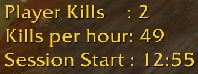
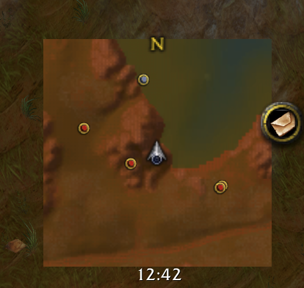

# RedridgeEssentials AddOn Pack
*Redridge Essentials* Addon Pack. Only for experienced gankers. This pack contains the following AddOns:

## AutoFlex
Automaticaly flexes (/flex emote) on enemy players that die nearby.

## KillCounter
Tracks enemy player kills per session and hour and displays them in a text overlay that you can drag-and-drop anywhere on your interface. Also announces kills in party chat. You can adjust the kill announce message in the first line of code in the *KillCounter.lua* file.

## SquareMap
Removes UI elements like buttons and frame from the minimap to make it square and maximize the visible area. Allows you to target enemy players by double-clicking pips from Humanoid Tracking.

## LifetimeKillsAlert
This AddOn notifies you once you reach a certain number of lifetime honorable kills. Useful if you want to make a screenshot of a specific number of honorable kills. You can modify the alert threshold in the first line of code in the *LifetimeKillsAlert.lua* file.

## ZoneMonitor (only for the WoW Vanilla 1.12.1 client)
Monitors the current zone of the player for the arrival and departure of high level players by periodically sending /who requests and and triggers visual and audible alerts. It is intended for spy chars in PvP/Ganking zones like Redridge Mountains to let you know, if high level players arrive in the zone that might come after you. The level threshold for alerts is 32 by default and configurable in the code of the AddOn.

